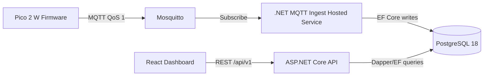
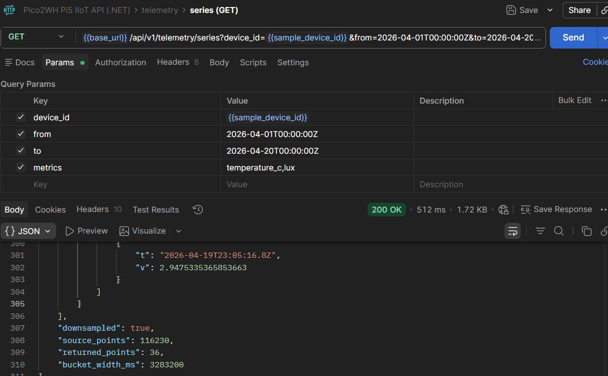

# IoT 監控系統（Production-Validated IIoT Platform）

[](https://dotnet.microsoft.com/)
[](https://www.postgresql.org/)
[](https://mqtt.org/)
[](https://react.dev/)

本專案是一套從 **Edge Firmware** 到 **Backend API** 再到 **Frontend Dashboard** 的工業物聯網（IIoT）監控系統。  
目標不是示範型專案，而是可在高頻遙測場景中驗證可用性的 Production-oriented 實作。

---

## 專案亮點（Executive Summary）

- 已在真實資料條件下驗證 **116,230 筆**高頻時序資料。
- 單次查詢 11 萬筆以上原始資料，API 回應約 **512 ms**。
- 透過 **Dapper + PostgreSQL `date_bin`** 進行 downsampling，壓縮率達 **3,228x**（116,230 -> 36）。
- 端到端資料鏈路具備：
  - **MQTT QoS 1**
  - 韌體 **Offline EEPROM Buffer**
  - 連線恢復後的 **throttled sync-back replay**
  - 後端 idempotent ingest（unique constraint + duplicate handling）

---

## 系統架構（Architecture）

### Clean Architecture（四層解耦）

- **Domain**：Entities / Value Objects / Repository Interfaces
- **Application**：Use Cases / CQRS Handlers / Service Contracts
- **Infrastructure**：EF Core / Dapper / MQTT Ingest / Identity / External Adapters
- **API**：HTTP Boundary / Auth / Serialization / Middleware Pipeline

### CQRS（MediatR）

- Command / Query 分離，讀寫路徑可獨立優化。
- 高負載讀取（Telemetry Series / Logs / UI Events）使用可控 SQL 路徑。

### Docker Compose 一鍵部署

```bash
docker compose up -d
```

包含 Nginx、Backend API、Mosquitto、PostgreSQL、PgAdmin。

---

## 端到端資料流（End-to-End Data Pipeline）



### MQTT Topic 命名（與程式實作一致）

定義於 `app/firmware/include/mqtt_topics.h`：

- `iiot/<site>/<device>/telemetry`
- `iiot/<site>/<device>/status`
- `iiot/<site>/<device>/telemetry/sync-back`
- `iiot/<site>/<device>/ui-events`
- `iiot/<site>/<device>/control`

後端預設訂閱：

- `iiot/+/+/telemetry/#`
- `iiot/+/+/ui-events`
- `iiot/+/+/status`

---

## Downsampling Engine（Dapper + PostgreSQL `date_bin`）

核心實作：`app/backend/src/Pico2WH.Pi5.IIoT.Infrastructure/Queries/TelemetrySeriesDapperQuery.cs`

### 為何讀取路徑選擇 Dapper

在大時間窗時序查詢中，手寫 SQL 可明確控制 execution plan、aggregation semantics 與 payload size，降低 ORM 通用映射開銷。

### Compute Pushdown 設計

- `targetPoints = clamp(max_points, 10..5000)`
- 先 `COUNT(*)` 取得 `source_points`
- `source_points > target_points` 時啟用 `date_bin` 分桶
- 數值欄位用 `avg(...)`
- 布林欄位（`pir_active`）用 `bool_or(...)`
- 回傳 metadata：`downsampled`, `source_points`, `returned_points`, `bucket_width_ms`

這讓運算在 PostgreSQL 端完成，避免 API 先載入 O(N) 原始資料再做記憶體聚合。

---

## 📊 Performance Benchmark

- Dataset：**116,230** telemetry points（1Hz 高頻採樣條件）
- Query scope：單次查詢 11 萬筆以上原始資料
- API latency：**~512 ms**
- Downsample result：**36 trend points**
- Compression ratio：**3,228:1**



---

## IoT Data Resilience（資料可靠性）

韌體側（`app/firmware`）：

- 使用 **MQTT QoS 1**（at-least-once delivery）
- 發送失敗時寫入 **EEPROM queue**
- 連線恢復後以節流方式 replay 至 `telemetry/sync-back`

後端側（`app/backend`）：

- topic parsing + route dispatch
- telemetry unique constraint：`(device_id, device_time, is_sync_back)`
- duplicate key (`23505`) handling，確保 replay 不重複汙染資料

---

## Database Schema 與索引策略

核心資料表：`prod.telemetry_records`

關鍵欄位：

- `device_id`, `site_id`
- `device_time`, `server_time`
- `is_sync_back`
- `temperature_c`, `humidity_pct`, `co2_ppm`, `pir_active`, `rssi` 等時序欄位

索引理念：

- 寫入冪等：`(device_id, device_time, is_sync_back)`（unique）
- 讀取加速：`(device_id, device_time)`（時間窗查詢核心索引）

---

## 🔍 資料庫維運與可觀測性 (Database Observability)

以下內容對應 `app/backend/sql/` 的維運 SQL 視圖，目標是在不改動應用邏輯的前提下，快速掌握 Data Ingestion Lag、Storage Efficiency 與 SLA 達成狀況。  
目前實測樣本約 **18.4 萬筆**遙測資料，資料表總體積約 **164MB**，入庫延遲觀測約 **12s**。

<details>
<summary><strong>入庫健康度監控（Data Ingestion Lag）</strong></summary>

此視圖用來觀察最新資料時間與目前時間差，作為 Data Ingestion Lag 指標。  
在目前環境中，實測可穩定追蹤到約 **12s** 延遲，適合作為 Broker/Consumer/DB 鏈路健康檢查基線。

```sql
CREATE OR REPLACE VIEW prod.v_monitor_status AS
SELECT 
    COUNT(*) as total_count,
    MAX(device_time) as last_data_received,
    NOW() - MAX(device_time) as data_lag -- 顯示延遲多久
FROM prod.telemetry_records;
```

</details>

<details>
<summary><strong>儲存效率分析（Storage Efficiency）</strong></summary>

此視圖拆分 data_size 與 index_size，協助評估 Storage Efficiency 與索引膨脹風險。  
在目前約 **164MB** 總體積場景下，Index 佔比實測約 **12%**，可作為後續 Index 調整與 VACUUM 策略的觀察基準。

```sql
/* 索引與數據分析視圖 */
CREATE OR REPLACE VIEW prod.v_storage_analysis AS
SELECT 
    pg_size_pretty(pg_relation_size('prod.telemetry_records')) AS data_size,
    pg_size_pretty(pg_total_relation_size('prod.telemetry_records') - pg_relation_size('prod.telemetry_records')) AS index_size;
```

</details>

<details>
<summary><strong>數據完整性驗證（SLA / Data Completeness）</strong></summary>

此視圖按日與裝置彙總筆數，並以平均上報間隔自動判斷 `Stress Test (1Hz)` 或 `Production (30s)` 模式。  
對目前約 **18.4 萬筆**資料，可用來驗證每日實際筆數是否符合預期 SLA，並快速定位缺漏時段或異常裝置。

```sql
-- 進階版：計算平均間隔來判斷模式
CREATE OR REPLACE VIEW prod.v_daily_data_completeness AS
SELECT 
    device_id,
    date_trunc('day', device_time) AS report_date,
    COUNT(*) AS actual_count,
    CASE 
        WHEN (86400.0 / COUNT(*)) < 5 THEN 'Stress Test (1Hz)' 
        ELSE 'Production (30s)' 
    END AS operation_mode,
    ROUND((COUNT(*) / 2880.0) * 100, 2) AS vs_standard_30s_pct
FROM prod.telemetry_records
GROUP BY 1, 2
ORDER BY 2 DESC;
```

</details>

---

## 技術棧（Technology Stack）

> 目前程式碼 runtime 為 **.NET 8**（`*.csproj` 目標框架），並可平滑規劃至 .NET 9。

- **Backend**：ASP.NET Core, MediatR (CQRS), FluentValidation
- **Data Access**：Dapper（讀取優化）, EF Core（Schema/Write）
- **Database**：PostgreSQL 18, Npgsql
- **Messaging**：MQTTnet + Mosquitto (TLS-capable)
- **Frontend**：React 19, TypeScript, Vite
- **Firmware**：C, Raspberry Pi Pico SDK, CMake
- **Infra**：Docker Compose, Nginx

---

## 前端介面展示（docs/images/admin）

### Telemetry Dashboard


### System Status


### Device Logs


---

## 快速開始（Quick Start）

### 1) 準備環境

```bash
git clone <repo-url>
cd iot-monitoring-system-dotnet
cp .env.example .env
```

### 2) 啟動完整服務

```bash
docker compose up -d
```

### 3) 後端本機啟動

```bash
cd app/backend/src/Pico2WH.Pi5.IIoT.Api
dotnet run
```

### 4) 前端本機啟動

```bash
cd app/frontend
npm ci
npm run dev
```

---

## 參考文件（Evidence & Specs）

- 規格文件：
  - `docs/specs/Pico2WH-Pi5-IIoT-專案開發規格書_v5.md`
  - `docs/specs/Pico2WH-Pi5-IIoT-專案開發規格書_v5_ASPNETCORE_4LAYER.md`
- SQL 實測腳本：
  - `app/backend/sql/pgadmin-read-queries-prod.sql`
  - `app/backend/sql/pgadmin-downsampling-core-prod.sql`
- API 測試集合：
  - `tests/postman/pico2wh-pi5-iiot-api.postman_collection.json`

---

## 技術結語

本專案的核心優勢在於三個關鍵詞：

- **運算下沉（Compute Pushdown）**：在 DB 端完成時序分桶與聚合。
- **高韌性資料鏈路（Resilient Data Pipeline）**：QoS + Buffer + Replay + Idempotency。
- **可維護架構（Maintainable Architecture）**：Clean Architecture + CQRS + 可觀測部署。

這使系統在高頻資料與長時間窗查詢下，仍能維持低延遲、可擴展與可驗證的工程品質。