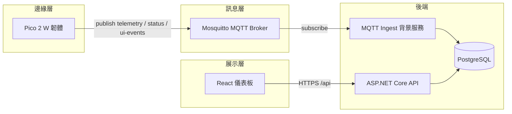

# IoT 監控系統（.NET）

[](https://dotnet.microsoft.com/)
[](https://www.postgresql.org/)
[](https://mqtt.org/)
[](https://react.dev/)
[](https://vitejs.dev/)

## 專案簡介

本專案為一套**邊緣到雲端**的工業物聯網（IIoT）監控解決方案，旨在將分散於現場的感測與裝置資料，透過標準化訊息通道匯流至後端服務，完成**持久化、查詢與營運可視化**。系統以 **Raspberry Pi Pico 2 W** 等裝置作為資料擷取端，經 **MQTT** 與後端 **ASP.NET Core** 解耦；後端負責驗證、網域邏輯與資料存取，並提供 **REST API** 供 **React** 儀表板與第三方整合。基礎設施（**Mosquitto**、**PostgreSQL**、**Nginx** 等）可透過儲存庫根目錄之 **Docker Compose** 於開發或部署環境中一併啟動，以利團隊重現與交付。

## 技術棧（Tech Stack）

| 分類 | 技術 |
|------|------|
| **執行環境** | **.NET 8**（`net8.0`）、**C**（**Pico SDK** 韌體） |
| **後端框架** | **ASP.NET Core**、**MediatR**、**FluentValidation**（驗證管線）、**Swagger**（**Swashbuckle**） |
| **資料存取** | **Entity Framework Core 8**、**Npgsql**（**PostgreSQL**；非 SQLite / SQL Server） |
| **訊息與整合** | **MQTT**（**MQTTnet** 客戶端；**TLS** 可選）、**Docker Engine API**（**Docker.DotNet**，容器狀態查詢） |
| **身分與安全** | **JWT Bearer**（**Microsoft.AspNetCore.Authentication.JwtBearer**）、自訂 **PBKDF2** 密碼雜湊 |
| **日誌** | **Serilog**（Console／Rolling File） |
| **前端** | **TypeScript**、**React 19**、**Vite 8**、**Mantine 9**、**React Router 7** |
| **DevOps／執行** | **Docker**、**Docker Compose**、**Nginx**（HTTPS／靜態資源／**API** 反向代理） |

## 核心功能

以下為目前程式碼中**已實作**之能力（實際啟用與否依 `appsettings`／環境變數而定）：

- **身分與工作階段**：使用者登入／登出、**JWT** 存取權杖與**重新整理權杖（Refresh Token）**流程。
- **遙測資料**：裝置遙測之**分頁列表**與**時間序列查詢**（供儀表板圖表使用）。
- **裝置控制**：透過 API 下達控制指令並與 **MQTT** 發佈流程整合（寫入稽核紀錄）。
- **裝置日誌與 UI 事件**：後端 **MQTT ingest** 將 **`status`**、**`ui-events`** 等主題資料寫入資料庫，並提供查詢 API；儀表板提供對應檢視頁面。
- **系統狀態**：查詢 **Docker** 主機上容器狀態（需後端可存取 **Docker** **API**／socket）。
- **資料持久化**：以 **EF Core** 管理結構化綱要，啟動時可選擇自動執行 **`Database.Migrate()`**（**`Database:AutoMigrate`**）。
- **韌體端（Pico）**：**Wi‑Fi**、**MQTT**（含 **TLS**／憑證設定範例）、多種感測器與本機排程／快取（詳見 `app/firmware/`）。

> **說明**：若需**主動推播、閾值報警或外部通知頻道**（Email／Line／Webhook 等），目前儲存庫內**未**包含獨立模組，可於後續以背景服務或規則引擎擴充。

## 專案架構（資料流）

邊緣裝置透過 **MQTT** 與後端解耦；後端訂閱指定主題將資料寫入 **PostgreSQL**，並以 **REST** 對前端與整合方提供服務。



**儲存庫結構（`app/`）**

| 路徑 | 說明 |
|------|------|
| `app/firmware/` | **Pico SDK** 韌體（C）：Wi‑Fi、**MQTT**（TLS）、感測器與裝置端排程。 |
| `app/backend/` | **.NET 8** Web API：**JWT**、**MediatR**、**EF Core**、**MQTT** ingest／發佈、**Docker** 狀態查詢。 |
| `app/frontend/` | **Vite** + **React** + **Mantine**：登入、遙測、裝置日誌／**UI events**、裝置控制、系統狀態等頁面。 |

## 快速開始

### 前置需求

- **.NET 8 SDK**（與專案 `TargetFramework` 一致）。
- **Node.js 20+**（建置／執行前端；版本可對齊 `conf/nginx` 或本機環境）。
- **PostgreSQL**（可本機安裝或使用 **Docker Compose** 內建服務）。
- （選用）**Docker**／**Docker Compose**，用於 **MQTT**、資料庫、**Nginx** 等一體啟動。

### 1. 取得原始碼與環境檔

```bash
git clone <本儲存庫 URL>
cd iot-monitoring-system-dotnet
cp .env.example .env
# 編輯 .env：資料庫帳密、MQTT 帳密、埠位、BACKEND_API_DATABASE_DEFAULT_SCHEMA 等
```

**注意**：**`dotnet`** 不會自動載入 **`.env`**；若不透過 **Compose** 注入環境變數，請於 shell 使用 **`export`**（例如 **`ConnectionStrings__Default`**、**`Database__DefaultSchema`**）或 **User Secrets**／**launchSettings**。

### 2. 啟動相依服務（擇一）

**方式 A：Docker Compose（建議用於完整環境）**

```bash
docker compose up -d
```

**方式 B：僅本機 PostgreSQL（與選用之 MQTT）**  
請自行確保 **PostgreSQL** 可連線，且連線字串與 **`Database:DefaultSchema`**（預設 **`dev`**）與實際資料庫一致。

### 3. 後端 API（`dotnet run`）

```bash
cd app/backend/src/Pico2WH.Pi5.IIoT.Api
# 依需要設定連線字串與 schema，例如：
# export ConnectionStrings__Default="Host=127.0.0.1;Port=5432;Database=你的資料庫;Username=...;Password=..."
# export Database__DefaultSchema=dev
dotnet run
```

- 預設 **HTTP** 設定檔會監聽 **`http://0.0.0.0:5163`**（**HTTPS** 為 **`7095`**；見 **`Properties/launchSettings.json`** 或 **`ASPNETCORE_URLS`**）。
- 若 **`Database:AutoMigrate`** 為 **`true`**（預設），啟動時會對目標資料庫執行 **EF Core** 遷移。
- 開發環境下可存取 **Swagger**：啟用 **`Development`** 時通常於 `/swagger`。

**遷移指令備份**：`app/backend/db-migration-commands.txt`。

### 4. 前端（開發模式）

```bash
cd app/frontend
npm ci
npm run dev
```

依 **`vite.config.ts`**／**`apiBase`** 設定後端 **URL**（本機多透過 **Proxy** 或與 **Nginx** 同網域）。

### 5. 韌體（選用）

燒錄、**Broker** 位址與 **TLS** 憑證對齊方式見 **`app/firmware/README.md`**。

---

## 根目錄其餘重點

- **`docker-compose.yml`**：協調 **Mosquitto**、**PostgreSQL**、**Nginx**、後端 API 等；啟動時讀取專案根目錄 **`.env`**。
- **`conf/`**：**Nginx**、**MQTT Broker**、**PostgreSQL**／**PgAdmin** 等映像與設定檔。
- **`scripts/setup/`**：**MQTT**／**Nginx** 憑證產生輔助腳本。
- **`tests/postman/`**：**API** **Postman** 集合（若已納入版本庫）。

---

授權圖示目前標示為「待補」；請於儲存庫根目錄新增 **`LICENSE`** 後，將本文件頂端 **License** 徽章連結更新為實際條款。
