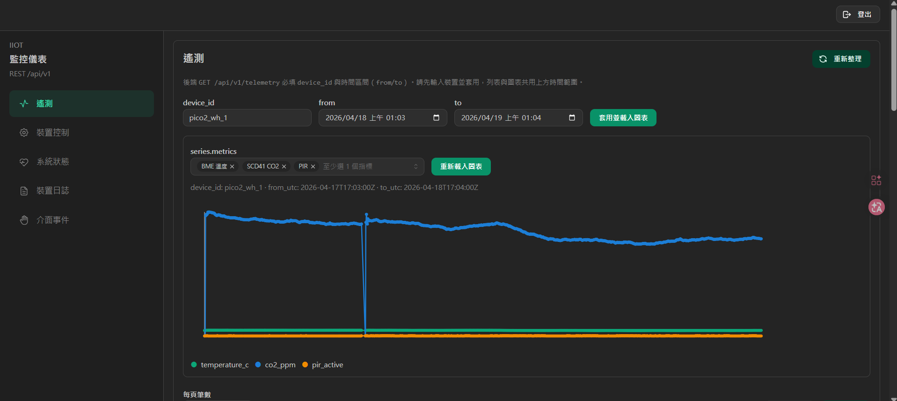
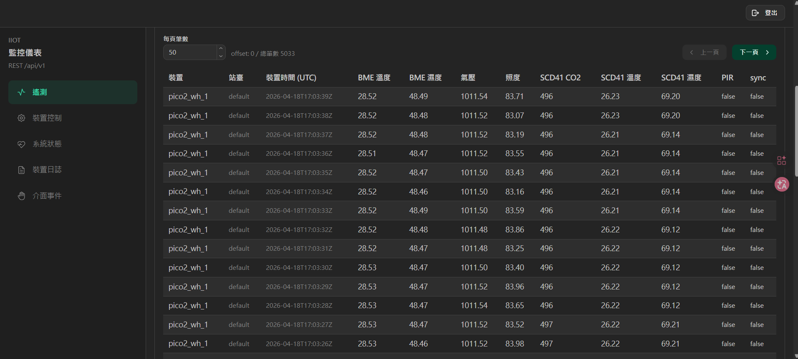
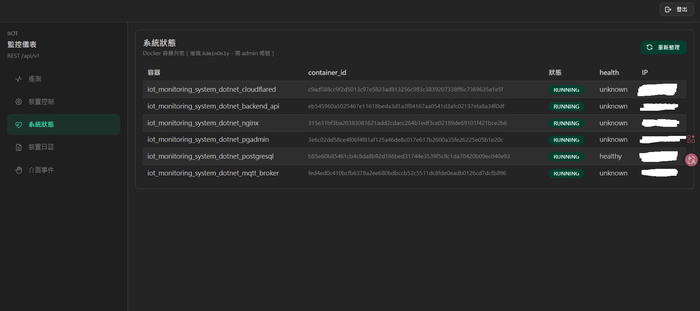
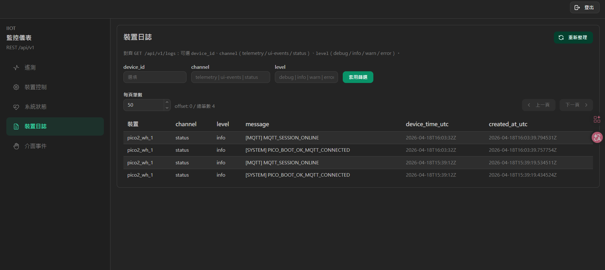
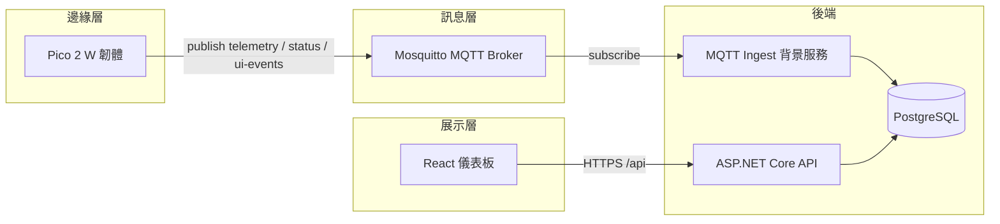
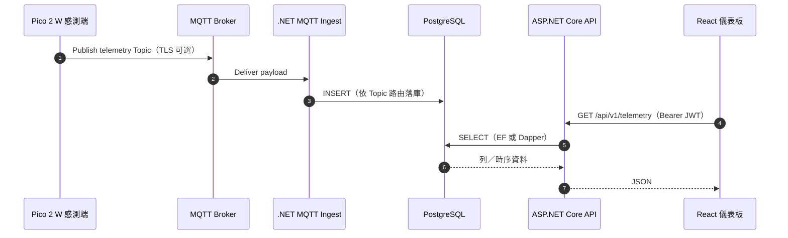

# IoT 監控系統（.NET）

[](https://dotnet.microsoft.com/)
[](https://www.postgresql.org/)
[](https://mqtt.org/)
[](https://react.dev/)
[](https://vitejs.dev/)

## 專案簡介

本專案為一套**邊緣到雲端**的工業物聯網（IIoT）監控解決方案，旨在將分散於現場的感測與裝置資料，透過標準化訊息通道匯流至後端服務，完成**持久化、查詢與營運可視化**。系統以 **Raspberry Pi Pico 2 W** 等裝置作為資料擷取端，經 **MQTT** 與後端 **ASP.NET Core** 解耦；後端負責驗證、網域邏輯與資料存取，並提供 **REST API** 供 **React** 儀表板與第三方整合。基礎設施（**Mosquitto**、**PostgreSQL**、**Nginx** 等）可透過儲存庫根目錄之 **Docker Compose** 於開發或部署環境中一併啟動，以利團隊重現與交付。

## 技術棧（Tech Stack）

| 分層／領域 | 採用技術 | 說明 |
|------------|----------|------|
| **邊緣韌體** | **C**、**Pico SDK**、**CMake** | **Pico 2 W** 感測採集、**Wi‑Fi**、**MQTT** 發佈；與後端以 **Topic** 解耦。 |
| **執行環境** | **.NET 8**（LTS）、**ASP.NET Core** | **Web API**、**Kestrel**；**MediatR**（**CQRS** 風格）、**FluentValidation**。 |
| **資料層** | **EF Core 8**、**Dapper**（讀路徑可切換）、**PostgreSQL 18**、**Npgsql** | 結構與遷移以 **EF** 為 **SoT**；大量列表／時序查詢可選 **Dapper**。 |
| **訊息與整合** | **MQTTnet**、**Mosquitto**、**Docker.DotNet** | **MQTT** 訂閱／ingest；**TLS** 可選；容器狀態經 **Docker Engine API**（**Unix socket**）。 |
| **身分與密碼** | **JWT Bearer**、自訂 **PBKDF2** 雜湊 | **Access**／**Refresh** 權杖流程；密碼**不**以明文儲存。 |
| **前端** | **TypeScript**、**React 19**、**Vite 8**、**Mantine 9**、**React Router 7** | **SPA** 儀表；以 **Bearer** 呼叫 **REST**。 |
| **可觀測與交付** | **Serilog**、**Docker Compose**、**Nginx** | 結構化日誌；**Compose** 一鍵堆疊；**Nginx** **TLS** 終止與 **API** 反代。 |

## 核心功能

以下為目前程式碼中**已實作**之能力；實際啟用與埠位依 **`appsettings`**／**環境變數**／**Compose** 而定。

| 能力域 | 說明 | 主要入口／技術 |
|--------|------|----------------|
| **身分與工作階段** | 登入／登出、**JWT Access** 與 **Refresh Token** 輪替與撤銷。 | `POST /api/v1/auth/*`、`JwtBearer` |
| **遙測** | 分頁列表、**時間序列**（**series**）供圖表；資料可經 **MQTT ingest** 寫入（見下表 **`telemetry`**）。 | **REST** + **MQTT** `telemetry/#` |
| **裝置控制** | **REST** 下達指令，經 **MQTT** 發佈並寫入**稽核**。 | **MQTT** `Publish`、審計表 |
| **裝置日誌與 UI 事件** | **ingest** 訂閱 **`status`**、**`ui-events`** 等，落庫並提供查詢 **API**；儀表對應頁面。 | 預設主題見下表 |
| **系統狀態** | 讀取 **Docker** 容器列表（需程序具 **socket** 權限）。 | `GET /api/v1/system/status` |
| **綱要與遷移** | **EF Core** **Migration**；啟動可選 **`Database:AutoMigrate`**。 | `Infrastructure/Persistence` |
| **韌體（Pico）** | **Wi‑Fi**、**MQTT**（**TLS**／**CA** 對齊 **`conf/mqtt_broker`**）、感測器與快取。 | `app/firmware/` |

#### MQTT ingest 預設訂閱主題（後端）

背景服務 **`MqttIngestHostedService`** 依 **`MqttOptions`** 訂閱 MQTT；若 **`Mqtt:SubscribeTopicFilters`** 未設定或為空，則使用下列**內建預設**（可於 `appsettings`／環境變數覆寫整份清單）。實作見 **`app/backend/src/Pico2WH.Pi5.IIoT.Infrastructure/Mqtt/MqttOptions.cs`**（`DefaultSubscribeTopicFilters`）。

| 預設主題篩選 | 用途 |
|--------------|------|
| `iiot/+/+/telemetry/#` | 遙測（`#` 含子路徑，例如 `sync-back`） |
| `iiot/+/+/ui-events` | **UI 事件** |
| `iiot/+/+/status` | 裝置 **`status`** 通道（狀態／日誌） |

> **說明**：若需**主動推播、閾值報警或外部通知頻道**（Email／Line／Webhook 等），目前儲存庫內**未**包含獨立模組，可於後續以背景服務或規則引擎擴充。

## 儀表板畫面預覽

以下截圖來自 **`docs/images/admin/`**（登入後之管理端頁面；實際資料依環境而定）。

### 遙測





### 系統狀態



### 裝置日誌



## 專案架構（資料流）

邊緣裝置透過 **MQTT** 與後端解耦；後端訂閱指定主題將資料寫入 **PostgreSQL**，並以 **REST** 對前端與整合方提供服務。



### 系統時序圖（端到端資料流）

自 **感測器採集** 至 **儀表板呈現** 的**主路徑**（實際 **Topic** 與 **REST** 路徑以程式與設定為準）：



**儲存庫結構（`app/`）**

| 路徑 | 說明 |
|------|------|
| `app/firmware/` | **Pico SDK** 韌體（C）：Wi‑Fi、**MQTT**（TLS）、感測器與裝置端排程。 |
| `app/backend/` | **.NET 8** Web API：**JWT**、**MediatR**、**EF Core**、**MQTT** ingest／發佈、**Docker** 狀態查詢。 |
| `app/frontend/` | **Vite** + **React** + **Mantine**：登入、遙測、裝置日誌／**UI events**、裝置控制、系統狀態等頁面。 |

## 安全性亮點（Security Highlights）

| 主題 | 設計 |
|------|------|
| **JWT + Refresh Token** | **Access Token** 用於 **API** **Bearer** 驗證；**Refresh Token** 用於輪替與登出撤銷；**機密與過期** 由 **環境變數**／**組態** 注入，**不**寫入版本庫。 |
| **MQTT TLS** | 韌體與 **Broker** 可透過 **TLS**（常見埠 **8883**）與 **CA** 憑證對齊（**`conf/mqtt_broker/certs`**、`appsettings` **Mqtt** 節）；**明文埠**僅建議封閉網路。 |
| **密碼儲存** | 使用者密碼使用 **PBKDF2** 類雜湊（**`PasswordHasherService`**），**不**儲存明文；登入時比對雜湊結果。 |
| **對外邊界** | **Nginx** 終止 **HTTPS**；**PostgreSQL**／**MQTT** 管理埠預設 **不**對公網；**Docker** 狀態經 **Unix socket** 並受 **Linux 群組** (`BACKEND_API_GROUP_ID`) 約束。 |

## 數據模型（MQTT Telemetry 契約範例）

後端 **`TelemetryMqttIngestService`** 解析 **JSON** 欄位（未出現之鍵可為空；詳見程式與 **`docs/specs/`** 內規格）。下列為**代表性** **Telemetry** payload（**Topic** 形如 **`iiot/{site_id}/{device_id}/telemetry`** 或 **`.../telemetry/sync-back`**）：

```json
{
  "device_time": "2026-04-18T12:00:00.000Z",
  "server_time": "2026-04-18T12:00:01.000Z",
  "is_sync_back": false,
  "temperature_c": 24.5,
  "humidity_pct": 55.0,
  "lux": 320.0,
  "co2_ppm": 450.0,
  "temperature_c_scd41": 24.3,
  "humidity_pct_scd41": 54.8,
  "pir_active": false,
  "pressure": 1013.25,
  "gas_resistance": 120000.0,
  "accel_x": 0.01,
  "accel_y": -0.02,
  "accel_z": 1.0,
  "gyro_x": 0.0,
  "gyro_y": 0.0,
  "gyro_z": 0.0,
  "rssi": -62
}
```

### Pico 2 W 硬體接線概覽（邏輯分區）

以下對應韌體預設腳位（**`app/firmware/main.c`**、**`app/firmware/include/firmware_config_defaults.h`**）；**I2C** 鮑率預設 **100 kHz**。**I2C0** 與 **I2C1** 為**兩條獨立匯流排**（不同 **GPIO**、電氣與時序可分流）。選配模組與 **SWD** 見 **`app/firmware/README.md`**。

```
┌─────────────────────────────────────────────────────────────────────────────┐
│                    Raspberry Pi Pico 2 W  (RP2350 + CYW43)                 │
│  ┌────────────┐                        ┌─────────────────────────────────┐
│  │ USB / 電源  │                        │ 板載 Wi‑Fi (CYW43) — 不需杜邦線   │
│  └────────────┘                        └─────────────────────────────────┘
└─────────────────────────────────────────────────────────────────────────────┘
                                    │
        ┌───────────────────────────┴───────────────────────────┐
        │  邏輯隔離：I2C0 與 I2C1 各用一組 SDA/SCL，避免跨匯流排短路混接   │
        ▼                                                          ▼
┌───────────────────────────────┐              ┌───────────────────────────────┐
│  I2C0  (GP4=SDA  GP5=SCL)      │              │  I2C1  (GP2=SDA  GP3=SCL) │
│  Standard-mode 100 kHz         │              │  Standard-mode 100 kHz         │
├───────────────────────────────┤              ├───────────────────────────────┤
│  ┌─────┐ ┌─────┐ ┌─────┐ ┌─────┐ ┌─────┐      │ ┌─────┐ ┌─────┐ ┌─────┐ ┌─────┐ │
│  │BME680│ │TSL  │ │MPU  │ │SH1106│ │PAJ7620│      │ │DS3231│ │SCD41│ │AT24 │ │LCD1602│ │
│  │0x76  │ │2561 │ │9250 │ │OLED │ │手勢  │      │ │ RTC │ │CO₂  │ │EEPROM│ │+PCF  │ │
│  │環境  │ │照度 │ │IMU  │ │0x3C │ │0x73  │      │ │     │ │0x62 │ │0x50 │ │0x27 │ │
│  └─────┘ └─────┘ └─────┘ └─────┘ └─────┘(選配) │ └─────┘ └─────┘ └─────┘ └─────┘ │
└───────────────────────────────┘              └───────────────────────────────┘
        共地 +3V3 依模組電流配線                              共地 +3V3 依模組電流配線

┌─────────────────────────────────────────────────────────────────────────────┐
│  數位輸入（非 I2C）                                                           │
│  GP6 ────────────────► Grove Mini PIR（OUT / SIG）                          │
│       (PIR_TEST_GPIO = 6，見 firmware_config_defaults.h)                     │
└─────────────────────────────────────────────────────────────────────────────┘

┌─────────────────────────────────────────────────────────────────────────────┐
│  除錯／燒錄（獨立於感測匯流排）                                                │
│  板載 DEBUG (JST-SH) ◄── Raspberry Pi Debug Probe：SWDIO / SWCLK / GND        │
│  ※ GPIO 僅 3.3 V 邏輯；勿將 5 V 直接接至 GPIO 腳位                             │
└─────────────────────────────────────────────────────────────────────────────┘
```

## 快速開始

### 前置需求

- **.NET 8 SDK**（與專案 `TargetFramework` 一致）。
- **Node.js 20+**（建置／執行前端；版本可對齊 `conf/nginx` 或本機環境）。
- **PostgreSQL**（可本機安裝或使用 **Docker Compose** 內建服務）。
- （選用）**Docker**／**Docker Compose**，用於 **MQTT**、資料庫、**Nginx** 等一體啟動。

### 1. 取得原始碼與環境檔

```bash
git clone <本儲存庫 URL>
cd iot-monitoring-system-dotnet
cp .env.example .env
# 編輯 .env：資料庫帳密、MQTT 帳密、埠位、BACKEND_API_DATABASE_DEFAULT_SCHEMA 等
```

**注意**：**`dotnet`** 不會自動載入 **`.env`**；若不透過 **Compose** 注入環境變數，請於 shell 使用 **`export`**（例如 **`ConnectionStrings__Default`**、**`Database__DefaultSchema`**）或 **User Secrets**／**launchSettings**。

### 2. 啟動相依服務（擇一）

**方式 A：Docker Compose（建議用於完整環境）**

```bash
docker compose up -d
```

**方式 B：僅本機 PostgreSQL（與選用之 MQTT）**  
請自行確保 **PostgreSQL** 可連線，且連線字串與 **`Database:DefaultSchema`**（預設 **`dev`**）與實際資料庫一致。

### 3. 後端 API（`dotnet run`）

```bash
cd app/backend/src/Pico2WH.Pi5.IIoT.Api
# 依需要設定連線字串與 schema，例如：
# export ConnectionStrings__Default="Host=127.0.0.1;Port=5432;Database=你的資料庫;Username=...;Password=..."
# export Database__DefaultSchema=dev
dotnet run
```

- 預設 **HTTP** 設定檔會監聽 **`http://0.0.0.0:5163`**（**HTTPS** 為 **`7095`**；見 **`Properties/launchSettings.json`** 或 **`ASPNETCORE_URLS`**）。
- 若 **`Database:AutoMigrate`** 為 **`true`**（預設），啟動時會對目標資料庫執行 **EF Core** 遷移。
- 開發環境下可存取 **Swagger**：啟用 **`Development`** 時通常於 `/swagger`。

**遷移指令備份**：`app/backend/db-migration-commands.txt`。

### 4. 前端（開發模式）

```bash
cd app/frontend
npm ci
npm run dev
```

依 **`vite.config.ts`**／**`apiBase`** 設定後端 **URL**（本機多透過 **Proxy** 或與 **Nginx** 同網域）。

### 5. 韌體（選用）

燒錄、**Broker** 位址與 **TLS** 憑證對齊方式見 **`app/firmware/README.md`**。

---

## 公開文件（`docs/`）

本儲存庫 **`docs/`** 目錄僅預期對外保留 **`docs/images/`** 與 **`docs/specs/`** 兩類內容（其餘內部筆記或草稿請勿依賴為公開契約）。

| 資料夾 | 用途 |
|--------|------|
| **`docs/images/`** | 儀表板等截圖資產（見上文「儀表板畫面預覽」）。 |
| **`docs/specs/`** | 專案開發規格書（**SoT**）。 |

### 規格書（`docs/specs/`）

| 主題 | 路徑（相對於儲存庫根目錄） |
|------|---------------------------|
| 全專案規格（硬體／韌體／階段） | `docs/specs/Pico2WH-Pi5-IIoT-專案開發規格書_v5.md` |
| 後端四層架構與 **EF／Dapper** 讀路徑 SoT | `docs/specs/Pico2WH-Pi5-IIoT-專案開發規格書_v5_ASPNETCORE_4LAYER.md` |

## 測試（後端）

於 **`app/backend/src`** 執行方案內測試（單元／整合；整合測試可能需 **Docker** 以啟動 **Testcontainers**）：

```bash
cd app/backend/src
dotnet test Pico2WH.Pi5.IIoT.FourLayer.sln
```

## API 與文件（開發時）

- **REST** 慣例前綴：**`/api/v1/...`**（實際路由見 **Swagger** 與各 **Controller**）。
- 後端以 **`Development`** 執行時，通常可開啟 **`/swagger`** 互動測試（正式環境是否暴露請依部署策略關閉）。

## 疑難排解（精簡）

| 現象 | 可檢查項目 |
|------|------------|
| 後端 **Docker** 儀表顯示無權限／`DOCKER_PERMISSION_DENIED` | 容器內使用者需能讀 **`/var/run/docker.sock`**；於 **`.env`** 將 **`BACKEND_API_GROUP_ID`** 設為宿主 **`docker`** 群組之 **GID**（`stat -c '%g' /var/run/docker.sock`），並重建 **`backend_api`** 服務。 |
| 本機 **`dotnet run`** 讀不到資料庫設定 | **`dotnet`** 不會自動載入 **`.env`**；請 **`export`** **`ConnectionStrings__Default`** 等，或使用 **Compose**／**User Secrets**。 |
| **MQTT** 連線失敗 | **Broker** 位址／埠／**TLS** 憑證與 **`appsettings`**／**Mosquitto** 設定是否一致；韌體端見 **`app/firmware/README.md`**。 |

## 後續可擴充（目前未內建）

- **主動推播**（Email／Line／Webhook）、**規則引擎式告警**。
- 規格書 **第四階段**之 **Redis**、**Prometheus + Grafana**、**Loki + Promtail** 等（見 **`docs/specs/Pico2WH-Pi5-IIoT-專案開發規格書_v5.md`** **§6.0.2**）。

---

## 根目錄其餘重點

- **`docker-compose.yml`**：協調 **Mosquitto**、**PostgreSQL**、**Nginx**、後端 API 等；啟動時讀取專案根目錄 **`.env`**。
- **`conf/`**：**Nginx**、**MQTT Broker**、**PostgreSQL**／**PgAdmin** 等映像與設定檔。
- **`scripts/setup/`**：**MQTT**／**Nginx** 憑證產生輔助腳本。
- **`conf/cloudflared/README.md`**：**Cloudflare Tunnel**（與 `docker compose --profile cloudflare`、Nginx **真實 IP**、後端 **ForwardedHeaders** 對齊說明）。
- **`tests/postman/`**：**API** **Postman** 集合（若已納入版本庫）。

---