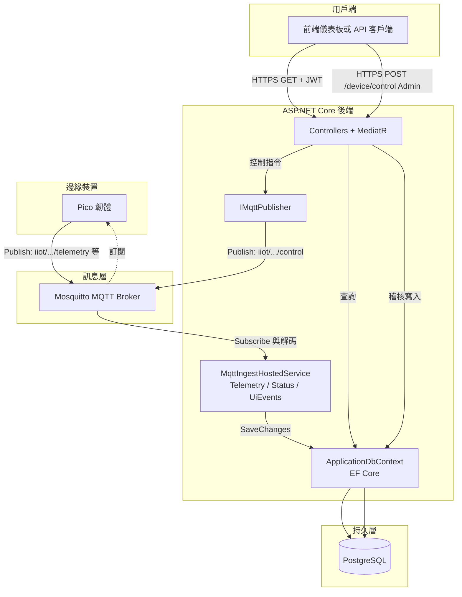

# 後端（ASP.NET Core）

本專案為 **.NET 8** **Web API**，採**四層式結構**：**Domain**（實體與儲存庫介面）、**Application**（**MediatR** 指令／查詢、**FluentValidation**、**AutoMapper**）、**Infrastructure**（**EF Core**、**MQTT**、**JWT**、**Docker** 用戶端）、**Api**（**Controllers**、**Middleware**、**Swagger**）。

> **程式分層說明**：`Pico2WH.Pi5.IIoT.Api` 底下**僅有** **`Controllers/`** 作為 **HTTP** 邊界；**無**獨立 **`Services/`** 或 **`Models/`** 資料夾——業務邏輯集中在 **Application** 的 **Features**（指令／查詢處理器），DTO 與驗證亦分佈於各 **Feature**；持久化模型在 **Infrastructure** 之 **`Persistence/`**。請以 **Controller → `ISender`（MediatR）→ Handler → Repository / MQTT** 理解呼叫鏈。

---

## API 端點對照表

基底路徑前綴為 **`/api/v1`**（無額外 **global prefix**）。下列除註明外，**`Authorize`** 表示需攜帶有效 **JWT**（`Authorization: Bearer <access_token>`）。

| HTTP | 路徑 | 授權 | 功能說明 |
|------|------|------|----------|
| **POST** | `/api/v1/auth/login` | 匿名 | 以帳密換取 **Access Token** 與 **Refresh Token**。 |
| **POST** | `/api/v1/auth/refresh` | 匿名 | 以 **Refresh Token** 換發新 **Access Token**（與輪替刷新）。 |
| **POST** | `/api/v1/auth/logout` | 匿名 | 作廢指定 **Refresh Token**。 |
| **GET** | `/api/v1/telemetry` | 已登入 | 依 **`device_id`**、時間區間 **`from`／`to`** 分頁查詢遙測列資料（**`page`**, **`page_size`**）。 |
| **GET** | `/api/v1/telemetry/series` | 已登入 | 依 **`device_id`**、**`metrics`**（逗號分隔）、**`from`／`to`** 查詢時間序列（圖表用）；可選 **`max_points`**。 |
| **GET** | `/api/v1/logs` | 已登入 | 依 **`device_id`**、**`channel`**（`telemetry`／`ui-events`／`status`）、**`level`**、時間區間等分頁查詢結構化裝置日誌。 |
| **GET** | `/api/v1/ui-events` | 已登入 | 依 **`device_id`**（必填）、**`site_id`**、時間區間分頁查詢裝置 **UI** 事件紀錄。 |
| **POST** | `/api/v1/device/control` | **Admin**（`AdminOnly` 原則） | 下達裝置控制（目前僅 **`set_pwm`**，**`value`** 0～100）；寫入稽核並經 **MQTT** 發佈至 **`iiot/{site_id}/{device_id}/control`**。 |
| **GET** | `/api/v1/system/status` | **Admin** | 查詢 **Docker** 容器狀態列表（**`include_stopped`** 預設 **true**）；需後端可存取 **Docker Engine API**。 |

**開發環境**下若 **`ASPNETCORE_ENVIRONMENT=Development`**，可於 **`/swagger`** 使用 **Swagger UI** 試呼叫（見 **`launchSettings.json`** 之 **`launchUrl`**）。

---

## 環境變數與配置指南

設定來源優先序遵循 **ASP.NET Core** 慣例：**環境變數**（含 **Docker Compose** 注入）可覆寫 **`appsettings.json`**。階層設定在環境變數中使用 **`__`**（雙底線）分隔，例如 **`Database__DefaultSchema`** 對應 **`Database:DefaultSchema`**。

### `appsettings.json` 結構範例（請替換為實際值）

下列為結構示意，**請勿**將真實密碼提交至版本庫；本機可搭配 **`dotnet user-secrets`** 或 **shell `export`**。

```json
{
  "ConnectionStrings": {
    "Default": "Host=127.0.0.1;Port=5432;Database=你的資料庫;Username=你的帳號;Password=你的密碼"
  },
  "Database": {
    "DefaultSchema": "dev",
    "AutoMigrate": true
  },
  "Jwt": {
    "Issuer": "Pico2WH.Pi5.IIoT",
    "Audience": "Pico2WH.Pi5.IIoT.Api",
    "SigningKey": "至少 32 字元之對稱金鑰，請於正式環境更換",
    "AccessTokenMinutes": 60,
    "RefreshTokenDays": 7
  },
  "Mqtt": {
    "Enabled": true,
    "Host": "127.0.0.1",
    "Port": 8883,
    "ClientId": "pico2wh-pi5-api",
    "Username": "mqtt_user",
    "Password": "MQTT_BROKER_密碼",
    "UseTls": true,
    "TlsCaCertificatePath": "相對於執行目錄之 CA 憑證路徑",
    "TlsClientCertificatePath": "",
    "TlsClientPrivateKeyPath": "",
    "TlsAllowUntrustedCertificate": false,
    "IngestEnabled": true,
    "SubscribeTopicFilters": [
      "iiot/+/+/telemetry/#",
      "iiot/+/+/ui-events",
      "iiot/+/+/status"
    ]
  },
  "Docker": {
    "Enabled": true,
    "Uri": "unix:///var/run/docker.sock"
  },
  "Serilog": { },
  "Logging": {
    "LogLevel": {
      "Default": "Information",
      "Microsoft.AspNetCore": "Warning"
    }
  },
  "AllowedHosts": "*"
}
```

### 常用環境變數對照

| 設定鍵（JSON 路徑） | 環境變數範例 | 說明 |
|---------------------|--------------|------|
| `ConnectionStrings:Default` | `ConnectionStrings__Default` | **PostgreSQL** **Npgsql** 連線字串。 |
| `Database:DefaultSchema` | `Database__DefaultSchema` | **EF** 預設 **PostgreSQL schema**（如 **`dev`**／**`prod`**）。 |
| `Database:AutoMigrate` | `Database__AutoMigrate` | 啟動時是否執行 **`Migrate()`**（`true`／`false`）。 |
| `Jwt:SigningKey` | `Jwt__SigningKey` | **JWT** 簽章用對稱金鑰（長度須符合設定）。 |
| `Mqtt:Host` | `Mqtt__Host` | **MQTT Broker** 位址（**Compose** 內常為服務名，如 **`mosquitto`**）。 |
| `Mqtt:Port` | `Mqtt__Port` | **Broker** 埠（**TLS** 常見 **8883**，明文 **1883**）。 |
| `Mqtt:Username` / `Mqtt:Password` | `Mqtt__Username` / `Mqtt__Password` | **Broker** 認證（須與 **Mosquitto** 設定一致）。 |
| `Mqtt:UseTls` | `Mqtt__UseTls` | 是否使用 **TLS** 連線 **Broker**。 |
| `Mqtt:TlsCaCertificatePath` | `Mqtt__TlsCaCertificatePath` | **CA** 憑證路徑（容器內路徑需與掛載一致）。 |
| `Docker:Uri` | `Docker__Uri` | **Docker Engine** **API**（**unix** socket 或 **TCP**）。 |

**資料庫連線**：優先設定 **`ConnectionStrings__Default`**，使 **EF Core** 與 **`dotnet ef`** 使用同一連線。**MQTT Broker 位址**：設定 **`Mqtt__Host`** 與 **`Mqtt__Port`**；若後端與 **Broker** 同在 **Docker** 橋接網路，**Host** 宜填 **Compose** 服務名稱而非 **`127.0.0.1`**（後者僅適用於後端在宿主、**Broker** 映射至本機埠的情境）。

**專案根目錄** **`.env`** 可由 **Compose** 讀取並注入後端容器；純 **`dotnet run`** 時**不會**自動載入 **`.env`**，請自行 **`export`** 或使用 **User Secrets**。

---

## 後端數據處理流程圖

以下描述「感測／狀態資料進入系統」與「儀表板／整合方讀取」之關係。**遙測與日誌寫入**主要經 **MQTT** 訂閱（**HTTP** 由裝置直接 **POST** 遙測之路徑**未**於本專案實作）。



**補充**：裝置控制為 **HTTP** 接受指令後，後端寫入 **`device_control_audits`** 並經 **MQTT** 下發；讀取遙測／日誌／**UI** 事件則為 **HTTP GET** 查詢已落庫資料。

---

## 開發者指南

### 方案與執行

| 項目 | 路徑 |
|------|------|
| 方案檔 | `src/Pico2WH.Pi5.IIoT.FourLayer.sln` |
| 啟動專案 | `src/Pico2WH.Pi5.IIoT.Api/Pico2WH.Pi5.IIoT.Api.csproj` |

```bash
cd src/Pico2WH.Pi5.IIoT.Api
dotnet run
```

預設 **HTTP** 監聽 **`http://0.0.0.0:5163`**（**HTTPS** **`7095`**），見 **`Properties/launchSettings.json`**。

### EF Core 工具與工作目錄

1. 安裝 **EF Core** 命令列工具（僅需一次）：

   ```bash
   dotnet tool install --global dotnet-ef
   ```

2. 後續 **`dotnet ef`** 指令請在 **`app/backend/src`** 執行（若自儲存庫根目錄操作，請先 **`cd app/backend/src`**）。

### 套用遷移（建立／更新資料表）

依 **`ConnectionStrings:Default`**（或環境變數 **`ConnectionStrings__Default`**）連線並套用全部待執行遷移：

```bash
dotnet ef database update \
  --project Pico2WH.Pi5.IIoT.Infrastructure/Pico2WH.Pi5.IIoT.Infrastructure.csproj \
  --startup-project Pico2WH.Pi5.IIoT.Api/Pico2WH.Pi5.IIoT.Api.csproj
```

單次覆寫連線字串（**bash**）：

```bash
export ConnectionStrings__Default="Host=127.0.0.1;Port=5432;Database=你的資料庫;Username=...;Password=..."
dotnet ef database update \
  --project Pico2WH.Pi5.IIoT.Infrastructure/Pico2WH.Pi5.IIoT.Infrastructure.csproj \
  --startup-project Pico2WH.Pi5.IIoT.Api/Pico2WH.Pi5.IIoT.Api.csproj
```

### 新增遷移

**`dev` schema**（輸出至 **`Migrations/Dev`**）：

```bash
export Database__DefaultSchema=dev
dotnet ef migrations add MigrationName \
  --project Pico2WH.Pi5.IIoT.Infrastructure/Pico2WH.Pi5.IIoT.Infrastructure.csproj \
  --startup-project Pico2WH.Pi5.IIoT.Api/Pico2WH.Pi5.IIoT.Api.csproj \
  --output-dir Migrations/Dev
```

**`prod` schema**（輸出至 **`Migrations/Prod`**）：

```bash
export Database__DefaultSchema=prod
dotnet ef migrations add MigrationName \
  --project Pico2WH.Pi5.IIoT.Infrastructure/Pico2WH.Pi5.IIoT.Infrastructure.csproj \
  --startup-project Pico2WH.Pi5.IIoT.Api/Pico2WH.Pi5.IIoT.Api.csproj \
  --output-dir Migrations/Prod
```

同一 **`ApplicationDbContext`** 僅維護**一條**遷移鏈；請與團隊約定 **`Dev`**／**`Prod`** 子目錄使用策略，避免 **snapshot** 分裂。

### 選用指令

- **列出遷移**：`dotnet ef migrations list`（同上 **`--project`**／**`--startup-project`**）。
- **還原至指定遷移**：`dotnet ef database update <MigrationId>`（**`MigrationId`** 為遷移類別名稱前綴時間戳；**`0`** 表示卸載全部遷移，慎用）。

更完整一行範例與 **Development** 環境補充見 **`db-migration-commands.txt`**。

---

## 其他設定與行為摘要

- **`Database:DefaultSchema`**：見上文環境變數；**Docker Compose** 可透過 **`BACKEND_API_DATABASE_DEFAULT_SCHEMA`** 注入（根目錄 **`docker-compose.yml`**）。
- **MQTT ingest**：需 **`Mqtt:Enabled`** 與 **`Mqtt:IngestEnabled`** 為 **`true`**，方可訂閱 **`SubscribeTopicFilters`** 內主題並寫入資料庫。
- **啟動時自動遷移**：**`Database:AutoMigrate`** 預設 **`true`** 時，**`Program.cs`** 會於啟動呼叫 **`Database.Migrate()`**。若改由 **CI** 專責遷移，請設 **`Database__AutoMigrate=false`**。
- **種子帳號**：手動 **SQL** 見 **`db/seed_users_manual.sql`**（上線後請變更密碼）。

## Docker 映像

- **Dockerfile** 位於本目錄根層；**build context** 為 **`app/backend`**（與儲存庫根目錄 **`docker-compose.yml`** 之 **`backend_api`** 一致）。
- 執行階段監聽由 **`ASPNETCORE_URLS`** 決定；**Compose** 常設為 **`http://+:${BACKEND_API_INSIDE_PORT}`**。
- 正式環境之連線字串、**MQTT** 帳密與 **TLS** 路徑宜由環境變數注入；若無需 **Docker** 狀態查詢可關閉 **`Docker:Enabled`**。

## 測試

- **`src/tests/`**（若未於 **`.gitignore`** 排除）含 **Domain**／**Application**／**Api** 等測試專案時，可於 **`app/backend/src`** 執行：

  ```bash
  dotnet test Pico2WH.Pi5.IIoT.FourLayer.sln
  ```

---
