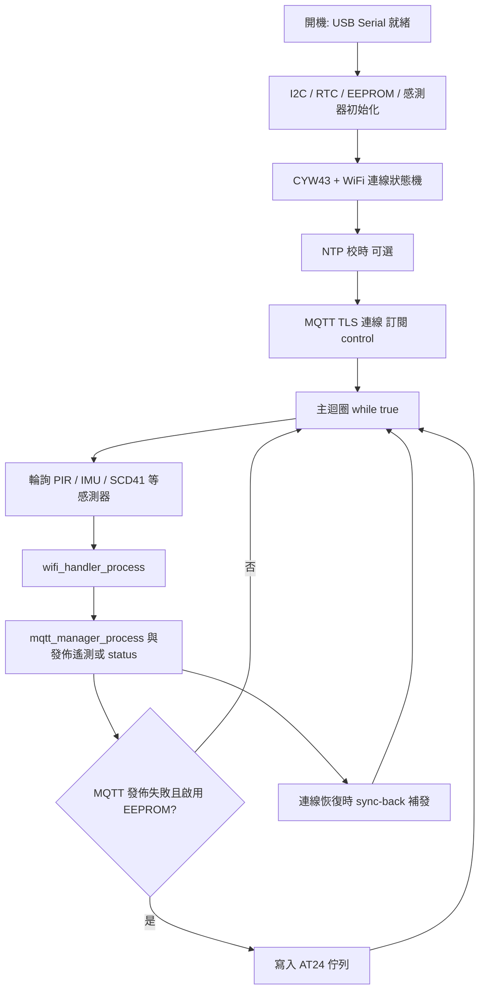

# 韌體（Raspberry Pi Pico 2 W）

本目錄為 **Raspberry Pi Pico 2 W**（**RP2350** + **CYW43439** Wi‑Fi）之 **C** 語言專案，使用 **Raspberry Pi Pico SDK** 與 **CMake** 建置。**未**使用 **Arduino IDE**／**.ino** 草稿，也**未**附 **PlatformIO** 設定檔；若您習慣 **PlatformIO**，需自行新增 **`platformio.ini`** 並對齊 **`CMakeLists.txt`** 之原始檔與連結庫（官方仍以 **Pico SDK + CMake** 為準）。

---

## 硬體需求（Hardware Requirements）

### 支援的開發板

| 項目 | 說明 |
|------|------|
| **目標板** | **Raspberry Pi Pico 2 W**（**CMake** 中 **`PICO_BOARD=pico2_w`**） |
| **不適用** | **ESP32**、**ESP8266**、第一代 **Pico（無 Wi‑Fi）** 等未於本 **`CMakeLists.txt`** 設定的板型 |

無線網路由板載 **CYW43439** 提供；韌體透過 **Pico SDK** 之 **`pico_cyw43_arch`** 與 **lwIP** 連線 **Wi‑Fi**。

### 感測器與週邊（依原始碼與預設位址）

下列為程式中驅動或選配之元件與常見 **I2C 7-bit** 位址（可在 **`secrets.h`**／**`firmware_config_defaults.h`** 覆寫）：

| 元件 | 型號／說明 | 預設 **I2C** 位址 | 匯流排（預設配線） |
|------|------------|-------------------|---------------------|
| 溫濕度／氣壓／**VOC** | **Bosch BME680** | **0x76**（可 **0x77**） | **I2C0**（**GP4**/**GP5**） |
| 照度 | **TSL2561** | **0x29** | **I2C0** |
| **IMU** | **InvenSense MPU-9250** | **0x68**（**AD0** 拉高時 **0x69**） | **I2C0** |
| **CO₂**／溫濕度 | **Sensirion SCD41** | **0x62** | **I2C1**（**GP2**/**GP3**） |
| **RTC** | **DS3231** 模組 | 依模組（常見 **0x68**） | **I2C1** |
| **EEPROM** 佇列 | **AT24C256**（斷線遙測快取） | **0x50** | **I2C1** |
| **OLED** | **SH1106** 128×64 | **0x3C** | **I2C0**（與環境感測同匯流排） |
| **LCD** | **1602** + **PCF8574** 背包 | **0x27**（常見 **0x3F**） | **I2C1** |
| **手勢（選配）** | **PAJ7620**（**Grove Gesture**） | **0x73** | **I2C0**（需於 **`secrets.h`** 開啟相關巨集） |
| **PIR** | **Grove Mini PIR** 等（數位輸出） | — | **GPIO6**（**GP6**），非 **I2C** |

> **說明**：本專案**未**內建 **DHT22**、**MQ-2** 等單匯流排／類比瓦斯感測器驅動；若需擴充，須自行新增驅動並接入主迴圈。

---

## 接線圖（Pin Mapping）

預設腳位定義於 **`main.c`**（**I2C0**／**I2C1**），與註解「**DS3231** 在 **I2C1**；**BME680**／**TSL2561** 在 **I2C0**」一致。

### 電源與接地

- 模組 **VCC** 請依模組規格接 **3.3 V**（**Pico 2 W** **I/O** 為 **3.3 V** 邏輯，**勿**將 **5 V** 直接接 **GPIO**）。
- 所有模組 **GND** 與 **Pico** **GND** 共地。

### **I2C0**（環境感測、**OLED**、**MPU-9250**、選配 **PAJ7620**）

| **Pico** 接腳 | 功能 | 連接 |
|---------------|------|------|
| **GP4** | **I2C0 SDA** | 各模組 **SDA**（並聯） |
| **GP5** | **I2C0 SCL** | 各模組 **SCL**（並聯） |
| **3V3** | 電源 | 模組 **VCC**（依模組電流需求配線） |
| **GND** | 接地 | 模組 **GND** |

鮑率預設 **100 kHz**（**Standard-mode**），見 **`ENV_I2C_BAUD_HZ`**。

### **I2C1**（**RTC**、**SCD41**、**AT24C256**、**LCD1602** 背包）

| **Pico** 接腳 | 功能 | 連接 |
|---------------|------|------|
| **GP2** | **I2C1 SDA** | **DS3231**／**SCD41**／**AT24C256**／**PCF8574** **SDA** |
| **GP3** | **I2C1 SCL** | 同上 **SCL** |
| **3V3** / **GND** | 電源／地 | 同上 |

### **PIR（被動紅外線）**

| **Pico** | 連接 |
|----------|------|
| **GP6** | 模組 **OUT**／**SIG**（預設 **`PIR_TEST_GPIO 6`**，內部上拉見 **`firmware_config_defaults.h`**） |
| **3V3** / **GND** | 依模組說明供電 |

---

## 開發環境設定

### 建置系統與工具鏈

| 項目 | 說明 |
|------|------|
| **建置** | **CMake** ≥ **3.13**、**Ninja** 或 **Make** |
| **SDK** | **Raspberry Pi Pico SDK**（環境變數 **`PICO_SDK_PATH`** 或專案旁 **`pico_sdk_import.cmake`**） |
| **編譯器** | **ARM GCC**（**arm-none-eabi-*`，版本依 **Pico SDK** 文件） |
| **偵錯／燒錄** | 可選：**OpenOCD** + **CMSIS-DAP**／**Debug Probe**（見 **`flash.sh`**）或 **UF2** 拖放 |

本專案**不是** **Arduino IDE** 一鍵編譯；亦**未**內建 **PlatformIO** 專案檔。

### 「程式庫」（Libraries）

韌體**未**使用 **Arduino Library Manager** 的 **`.zip`** 函式庫，而是透過 **Pico SDK** 與 **`CMakeLists.txt`** **`target_link_libraries`** 連結，主要包括：

| 連結目標（節錄） | 用途 |
|------------------|------|
| **`pico_stdlib`** | **GPIO**、**時間**、**USB** **stdio** 等 |
| **`hardware_i2c`** | **I2C** 主控 |
| **`pico_cyw43_arch_lwip_threadsafe_background`** | **Wi‑Fi**（**CYW43**）與 **lwIP** |
| **`pico_lwip_mqtt`**、**`pico_lwip_mbedtls`**、**`pico_mbedtls`** | **MQTT** over **TLS** |
| **`pico_lwip_sntp`** | **NTP** 校時 |
| **`pico_mbedtls`** | **TLS**／憑證驗證 |

專案內 **`.c`** 實作：**BME680**、**SCD41**、**TSL2561**、**MPU-9250**、**DS3231**、**SH1106**、**AT24C256**、**LCD1602+PCF8574**、**MQTT**／**Wi‑Fi** 封裝等。

### **CA 憑證**

**CMake** 會嘗試讀取 **`../../conf/mqtt_broker/certs/server/ca.crt`**（見 **`CMakeLists.txt`**）產生 **`generated_ca_cert.h`**，供 **MQTT TLS** 驗證；若檔案不存在則產生空憑證陣列（連線行為依 **Broker** 設定而定）。

---

## MQTT 設定指南

1. 複製 **`secrets.h.example`** 為 **`secrets.h`**（**勿**將 **`secrets.h`** 提交至版本庫）。
2. 修改下列巨集：

| 巨集 | 說明 |
|------|------|
| **`WIFI_SSID`** | **Wi‑Fi** 名稱 |
| **`WIFI_PASSWORD`** | **Wi‑Fi** 密碼 |
| **`MQTT_BROKER_IP`** | **Broker** 位址（**IPv4** 字串，例如 **`"192.168.1.10"`** 或區網主機名，依實作為準） |
| **`MQTT_BROKER_PORT`** | **Broker** 埠（**TLS** 常見 **8883**；與後端 **`appsettings`**／**Mosquitto** 一致） |
| **`MQTT_USER`**／**`MQTT_PASS`** | **Broker** 認證（須與 **Mosquitto** **`password_file`** 等一致） |
| **`MQTT_NAMESPACE_PREFIX`** | 預設 **`iiot`** |
| **`MQTT_SITE`** | 站點／租戶識別，例如 **`default`** |
| **`MQTT_CLIENT_ID`** | 裝置識別（建議唯一，對應後端 **`device_id`**） |

### **Topic** 路徑（發佈／訂閱）

預設由 **`include/mqtt_topics.h`** 組出（可在 **`secrets.h`** 以 **`#define MQTT_TOPIC_*`** 覆寫完整字串）：

| 用途 | 預設模式 |
|------|----------|
| 遙測 | **`iiot/<MQTT_SITE>/<MQTT_CLIENT_ID>/telemetry`** |
| 狀態／裝置日誌類 | **`.../status`** |
| 斷線補發 | **`.../telemetry/sync-back`** |
| **UI** 事件 | **`.../ui-events`** |
| **下行控制**（韌體**訂閱**） | **`.../control`** |

後端 **`Mqtt:SubscribeTopicFilters`** 須能收到上述 **publish** 前綴（例如 **`iiot/+/+/telemetry/#`**）。修改 **Topic** 後請一併對齊 **Broker ACL** 與後端設定。

---

## 燒錄流程圖（Mermaid）

下列描述開機後**主迴圈協作式**排程：**非**以深度休眠為主軸，而是 **`while(true)`** 內輪詢感測器、**Wi‑Fi**／**MQTT** 狀態機與定時上報（與 **`ENV_REPORT_INTERVAL_MS`** 等間隔）。



**燒錄到開發板**（依工具而異）：

1. **CMake** 建置產生 **`build/iiot_firmware.elf`**／**`.uf2`**。  
2. 使用 **`flash.sh`**（**OpenOCD** + **CMSIS-DAP**）或 **BOOTSEL** **UF2** 燒錄。  
3. 上電後透過 **USB** 序列埠觀察 **log**（見下節）。

---

## 偵錯（Debugging）

### **Serial Monitor**（**USB** **stdio**）

專案啟用 **`pico_enable_stdio_usb(..., 1)`**（**`CMakeLists.txt`**），除錯訊息經 **USB CDC** 輸出。

1. 燒錄後以 **USB** 連接 **Pico 2 W** 至 **PC**。  
2. 在系統中出現的 **COM** 埠（**Windows**）或 **`/dev/ttyACM*`**（**Linux**）開啟序列埠終端機。  
3. **鮑率**：**Pico SDK** 預設 **USB stdio** 多為**不需**固定鮑率（虛擬 **COM**）；若工具要求，可試 **115200**。  
4. 觀察關鍵字：  
   - **`[BOOT]`**、**`USB serial ready`**：開機與延遲（**`BOOT_POST_USB_DELAY_MS`**）  
   - **`[WiFi]`**／連線成功與 **RSSI**  
   - **`[MQTT]`**／**`publish`**／**`telemetry`**  
   - **`[SCD41]`**、**`[BME680]`**、**`[PAJ7620]`** 等感測器列印  
   - **`[DEBUG] mqtt_cfg`**：啟動時列印 **Broker**、**Topic**、**client_id**（確認與 **`secrets.h`** 一致）

### 開機 **I2C** 掃描（選用）

在 **`secrets.h`** 設定 **`#define ENABLE_I2C_BOOT_SCAN 1`** 後重新編譯，序列埠會列出匯流排上裝置位址，便於核對接線與位址衝突。

---

## 建置指令（摘要）

於 **`app/firmware`**：

```bash
mkdir -p build && cd build
cmake -DPICO_BOARD=pico2_w ..
cmake --build . -j$(nproc)
```

產物名稱 **`iiot_firmware`**（**`.elf`**／**`.uf2`** 等）。自動化燒錄範例見 **`./flash.sh`**（需已安裝 **OpenOCD** 與對應 **interface** 設定）。

---

## 相關檔案

| 檔案 | 用途 |
|------|------|
| **`secrets.h.example`** | 複製為 **`secrets.h`** 並填入 **Wi‑Fi**／**MQTT**／**Topic**／間隔參數 |
| **`include/mqtt_topics.h`** | **Topic** 字串組合規則 |
| **`include/firmware_config_defaults.h`** | **PIR** 腳位、**EEPROM** 槽位、**OLED**／**LCD** 等預設 |
| **`../../conf/mqtt_broker/certs/`** | **TLS** **CA** 憑證來源（與 **CMake** 內嵌路徑對齊） |
