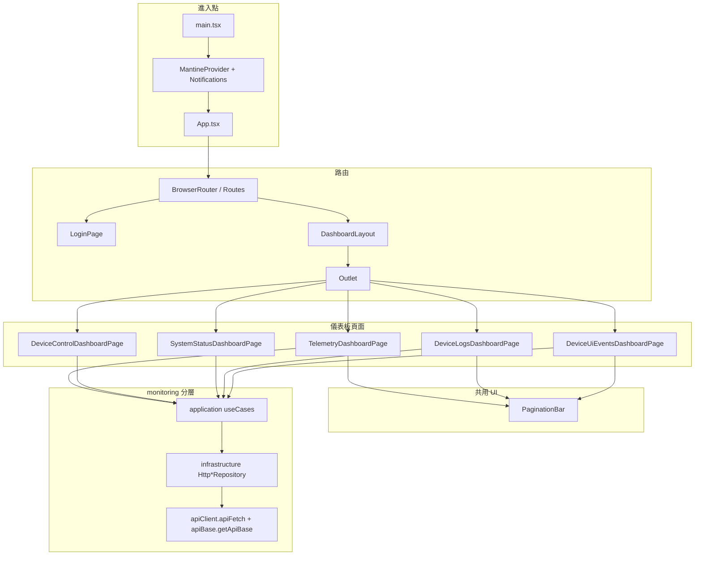

# 前端（React + Vite）

本目錄為 **單頁應用（SPA）**，以 **Vite** 建置、**React** 與 **TypeScript** 開發。監控相關程式採簡化 **Clean Architecture**：**`monitoring/domain`**（實體與 **Repository** 介面）、**`monitoring/application`**（用例函式）、**`monitoring/infrastructure`**（以 **`fetch`** 實作之 **HTTP** Repository）、**`presentation`**（頁面、版面與共用元件）。全域樣式與元件以 **Mantine** 為主，並搭配 **PostCSS**（**`postcss-preset-mantine`**），**未**使用 **Tailwind CSS**。

---

## 專案技術棧（Frontend Tech Stack）

以下依 **`package.json`** 與實際依賴整理。

| 類別 | 技術 | 說明 |
|------|------|------|
| **建置工具** | **Vite 8** | 開發伺服器、**HMR**、生產打包（**`vite build`**）。 |
| **框架** | **React 19**（**`react`／`react-dom`**） | **SPA**；**非** **Next.js**／**Vue**。路由為 **`react-router-dom` 7**。 |
| **語言** | **TypeScript 5.9** | 嚴格型別；路徑別名 **`@/`** 對應 **`src/`**（見 **`vite.config.ts`**、**`tsconfig.json`**）。 |
| **UI 元件庫** | **Mantine 9**（**`@mantine/core`**、**`@mantine/hooks`**、**`@mantine/notifications`**） | 版面（**`AppShell`**）、表單、表格、**Paper**、通知等。 |
| **圖示** | **Tabler Icons**（**`@tabler/icons-react`**） | 導覽與按鈕圖示。 |
| **樣式** | **Mantine** 內建 **CSS** + **CSS Modules**（如 **`DashboardLayout.module.css`**） | **未**採用 **Ant Design**、**MUI** 或 **Tailwind**。 |
| **狀態管理** | **無** **Redux**、**Zustand**、**MobX** | 以 **React `useState`／`useCallback`／`useEffect`** 為主；登入權杖存 **`localStorage`**（**`authStorage.ts`**）。**未**使用 **React Context API** 封裝全域 Store。 |
| **資料取得** | 原生 **`fetch`**（封裝於 **`apiFetch`**） | **未**使用 **Axios**、**SWR**、**TanStack Query** 或 **Relay**。 |

---

## 核心功能展示（Features）

以下為目前程式碼中**已實作**之畫面與能力（**非**即時推送：資料多為進入頁面或手動「重新整理」時以 **REST** 拉取）。

| 功能 | 說明 |
|------|------|
| **登入／工作階段** | **`LoginPage`**：呼叫 **`POST /api/v1/auth/login`**，將 **Access／Refresh Token** 寫入 **`localStorage`**；**`apiFetch`** 自動附帶 **`Authorization`**，**401** 時嘗試 **`/auth/refresh`**。 |
| **遙測儀表** | **`TelemetryDashboardPage`**：依 **`device_id`** 與時間區間查詢 **`GET /api/v1/telemetry`**（分頁列表）；另以 **`GET /api/v1/telemetry/series`** 取得序列資料，並以 **內嵌 SVG**（**`polyline`**）繪製**歷史趨勢圖**（非第三方 **Chart** 函式庫）。 |
| **裝置控制** | **`DeviceControlDashboardPage`**：**Admin** 透過 **`POST /api/v1/device/control`** 下達 **`set_pwm`**（0～100）。 |
| **系統狀態** | **`SystemStatusDashboardPage`**：**Admin** 呼叫 **`GET /api/v1/system/status`**，以表格與 **Mantine `Badge`** 顯示 **Docker** 容器狀態／健康度（**非**即時串流，需手動重新整理）。 |
| **裝置日誌** | **`DeviceLogsDashboardPage`**：**`GET /api/v1/logs`**，支援 **`channel`**（如 **telemetry**／**ui-events**／**status**）、**`level`**（**debug**／**info**／**warn**／**error**）篩選之分頁列表。 |
| **介面事件** | **`DeviceUiEventsDashboardPage`**：**`GET /api/v1/ui-events`**，依裝置與時間區間之分頁列表。 |
| **側欄導覽與版面** | **`DashboardLayout`**（**Mantine `AppShell`**）：導向遙測、控制、系統狀態、日誌、介面事件；**登出**呼叫 **`POST /api/v1/auth/logout`**。 |
| **分頁列** | **`PaginationBar`**：與列表頁搭配之分頁控制。 |

> **說明**：本前端**未**實作獨立「設備列表管理」**CRUD** 頁面；**`device_id`** 多由使用者手動輸入。**未**使用 **WebSocket**／**MQTT over WebSocket**／**SignalR** 做即時儀表板推送；若需「即時」效果，須自行改為定時輪詢或於後續接入即時通道。

---

## 環境變數配置（Environment Variables）

本專案為 **Vite**，公開給瀏覽器的變數必須以 **`VITE_`** 為前綴。**Next.js** 常見的 **`NEXT_PUBLIC_*`** 在此專案**不適用**；請使用下列變數。

| 變數 | 用途 |
|------|------|
| **`VITE_API_BASE`** | 後端 **API** 的 **Origin**（不含尾隨斜線）。若為**空字串**或未設定，則請求會對「**目前網頁同源**」發送（例如經 **Nginx** 將 **`/api`** 反向代理至後端時，通常保持空白即可）。 |

**範例檔**：複製 **`.env.example`** 為 **`.env`**（或 **`.env.local`**），依環境修改：

```bash
# 留空 = 與目前頁面同源（經 Nginx 時常維持空字串）
VITE_API_BASE=

# 本機繞過 Vite Proxy、直連後端（範例）
# VITE_API_BASE=http://127.0.0.1:5163

# 自訂 HTTPS 入口（範例）
# VITE_API_BASE=https://localhost:8443
```

**開發模式**：**`vite.config.ts`** 已將 **`/api`** 代理至 **`http://127.0.0.1:5163`**（與後端 **`launchSettings`** **HTTP** 埠一致）。若 **`VITE_API_BASE`** 為空，瀏覽器會向 **`http://localhost:<vite-port>/api/...`** 請求，由 **Vite** 轉發至後端。

**生產建置**：靜態檔多由 **Nginx** 與後端同網域，**`VITE_API_BASE`** 常維持空白，使 **`fetch('/api/v1/...')`** 與頁面同源。

---

## 開發與建置指令

於 **`app/frontend`** 目錄執行：

| 指令 | 說明 |
|------|------|
| **`npm install`** | 安裝 **`package.json`** 依賴（建議使用與 **`package-lock.json`** 一致之 **`npm ci`** 於 **CI** 環境）。 |
| **`npm run dev`** | 啟動 **Vite** 開發伺服器（預設 **`http://localhost:5173`**，實際埠以終端機輸出為準）；支援 **HMR**。 |
| **`npm run build`** | 執行 **`tsc -b`** 型別檢查後，**`vite build`** 輸出至 **`dist/`**，供 **Nginx** 靜態託管或 **`npm run preview`** 預覽。 |
| **`npm run preview`** | 本機預覽生產打包結果。 |
| **`npm run lint`** | 以 **ESLint** 檢查程式碼。 |

**前置**：建議 **Node.js 20+**（與倉庫內 **Docker**／**Nginx** 範本所用 **Node** 映像版本對齊為佳）。

---

## 組件架構圖（Component Architecture）



---

## API 溝通機制

1. **傳輸層**：一律使用瀏覽器原生 **`fetch`**，集中封裝於 **`src/infrastructure/apiClient.ts`** 之 **`apiFetch`**。  
2. **基底網址**：**`getApiBase()`**（**`apiBase.ts`**）讀取 **`import.meta.env.VITE_API_BASE`**；與路徑拼接為 **`${base}/api/v1/...`**。  
3. **認證**：由 **`authStorage`** 讀寫 **Access／Refresh Token**；**`apiFetch`** 附加 **`Authorization: Bearer`**；回應 **401** 時對 **`/api/v1/auth/refresh`** 重試一次後重送原請求。  
4. **Repository 實作**：**`monitoring/infrastructure/repositories/Http*Repository.ts`** 將各用例參數轉成 **Query String**，呼叫 **`apiFetch`**，並將 **JSON** 解析為 **domain** 型別。  
5. **即時性**：**無** **WebSocket**／**SignalR**／**MQTT.js** 訂閱；儀表資料為**請求當下**之快照。遙測頁透過 **`useEffect`** 在篩選變更時觸發載入，並提供手動「重新整理」按鈕，屬**按需／手動刷新**，而非後端主動推送。

---

## 目錄結構（摘要）

| 路徑 | 角色 |
|------|------|
| **`src/presentation/`** | 頁面、**`DashboardLayout`**、**`PaginationBar`** 等 UI。 |
| **`src/monitoring/domain/`** | 實體、**Repository** 介面、分頁與查詢型別。 |
| **`src/monitoring/application/useCases/`** | 呼叫 **Repository** 之用例函式。 |
| **`src/monitoring/infrastructure/`** | **HTTP** **Repository** 實作、**`monitoringModule`** 匯出聚合 **API**。 |
| **`src/infrastructure/`** | **`apiClient`**、**`apiBase`**、**`authStorage`**（跨功能基礎設施）。 |
| **`src/core/`** | 共用 **`UseCase`** 型別與 **HTTP** query 工具。 |

更細的 **Proxy**、**Nginx** 與後端埠位請一併參考儲存庫根目錄 **`README.md`** 與 **`vite.config.ts`**。
